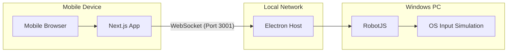

# Architecture 🏗️

XOBX is built as a distributed system consisting of two primary components communicating over a local area network (LAN).

## System Overview



## Internal Components

### 1. Web Controller (`web/`)

- **Framework**: Next.js 15+ (App Router).
- **Styling**: Tailwind CSS & Framer Motion for animations.
- **Communication**: Standard `WebSocket` API for sending real-time input packets.
- **Key Features**:
  - **Dynamic Orientation**: Detects portrait mode and prompts for landscape rotation.
  - **State Management**: Uses React hooks for handling connection status and input feedback.
  - **Visual Feedback**: Real-time visualization of internal rumble motors and trigger activation.

### 2. Windows Host (`windows/`)

- **Runtime**: Electron & Node.js.
- **Input Bridge**: `RobotJS` for low-level keyboard and mouse simulation.
- **Server**: `Express` & `ws` (WebSockets).
- **Input Mapping**:
  - **Buttons**: A, B, X, Y, Menu, View map to specific keyboard keys defined in `server.js`.
  - **Left Joystick**: Maps to "WASD" keys with a configurable threshold.
  - **Right Joystick**: Maps to Mouse movement for camera control in games.

## Communication Protocol

Data is sent as JSON strings over WebSockets:

```json
{
  "type": "button-down",
  "data": "a"
}
```

Or for joysticks:

```json
{
  "type": "joystick-left",
  "data": {
    "vector": { "x": 0.5, "y": -0.8 },
    "distance": 0.94
  }
}
```

## Security & Connectivity

XOBX relies on both devices being on the same subnet. Since most mobile browsers block mixed content (WS on HTTPS pages), the app includes logic to handle both `ws://` and `wss://` depending on the hosting environment.
